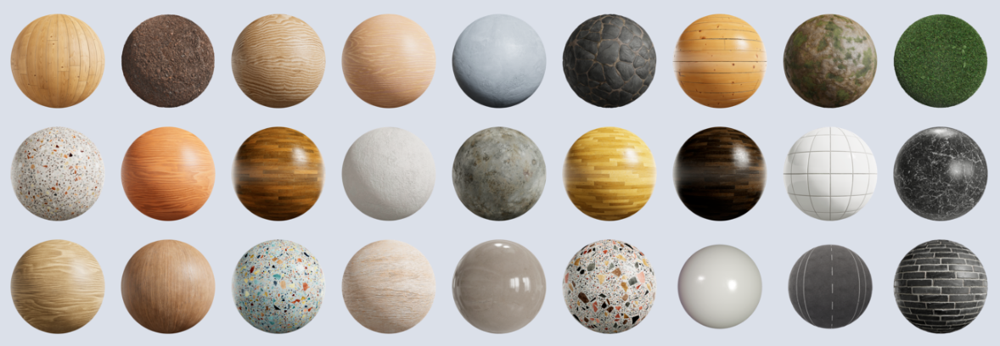
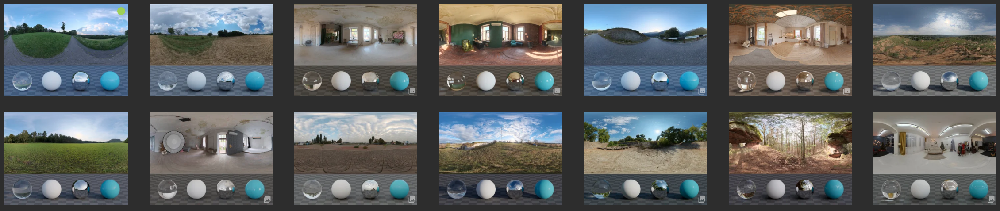

Download Resources
=============================================

Download PBR Textures
----------------------

To run ``bf.get_pbr_material_infos()`` and ``bf.add_pbr_material()``, we have to download the 
PBR textures first. We use textures from https://ambientcg.com/.

.. code-block:: shell
    
    python scripts/download_pbr.py

This script will automatically download 1153 pbr textures to ``resources/cctextures``, totalling 17.8 GB.

Reference: https://help.ambientcg.com/02-Using%20the%20assets/The_different_PBR_maps.html

Download HDR Textures
----------------------

To run ``bf.get_hdr_material_infos()`` and ``bf.set_hdr_background()``, we have to download the 
HDR textures first. We use textures from https://polyhaven.com/hdris. 

.. code-block:: shell

    python scripts/download_hdr.py

This script will automatically download 476 hdr textures to ``resources/hdr``, totalling 12.4 GB.

Download & Process ABC datasets
--------------------------------

.. image:: ../images/abc-header.png
    :width: 1024

ABC(A Big CAD) Model Dataset contains 1 million models.
It's too big to use the raw datasets (600GB compressed files, several TB of model files).

To use this dataset, we have to simplify it. We write a script to automatically download 
and process the ABC dataset.

There are a total of 100 zip packages, each with 10,000 models. To download and process
the first zip package:

.. code-block::

    python scripts/download_and_process_abc.py --abc_index=0

The processed model files will be in ``resources/abc/done/abc_00??_stl2_v00`` directory.

What does this script do?

.. code-block:: text

    download zip package, check md5 sum
    uncompress zip package
    for model in the raw models:
        if model too big, skip
        if model have multiple parts, skip
        decimate model to 10000 faces
        reset model's origin to center of mass
        export model

Multiple process running (3 processes):

.. code-block::

    for i in {0..99};do echo $i;done | xargs -n 1 -P 3 sh -c 'python scripts/download_and_process_abc.py --abc_index=$0

The processed ABC dataset have 769,196 items, totalling 179.3 GB.
