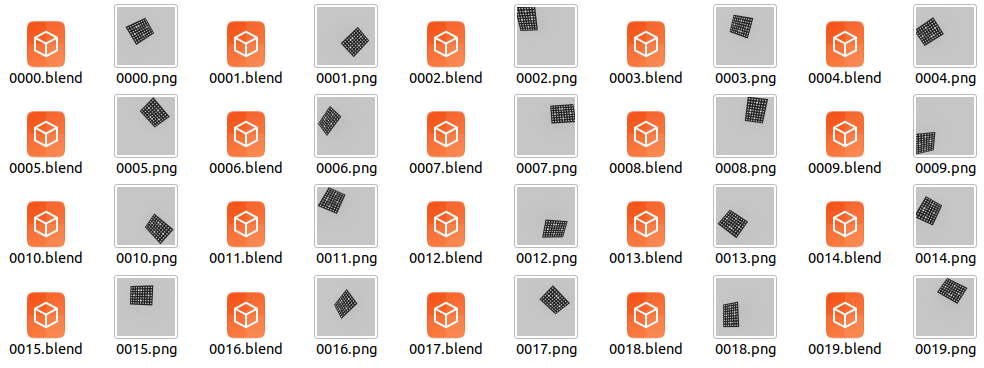
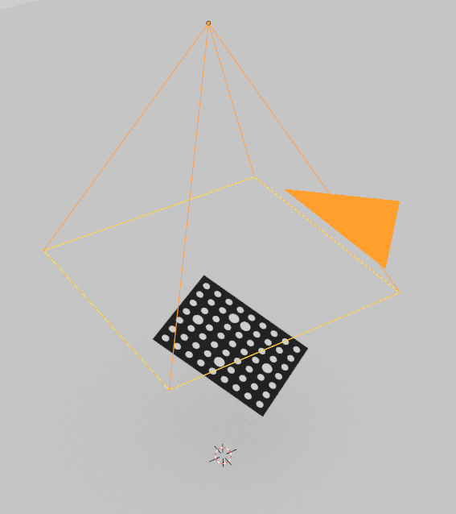

calibration
======================================

.. code-block:: shell

    blender -b --python examples/calibration.py

The calibration board will be placed randomly within the field of view.

