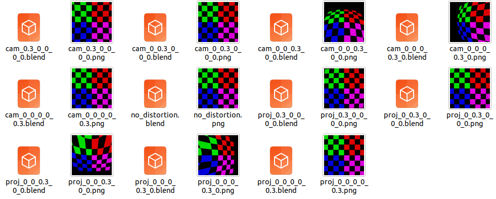

distortion
======================================

.. code-block:: shell

    blender -b --python examples/distortion.py

This script will generate 11 images and corresponding blend files:

    - no distortion: 1 image
    - camera distortion: 5 images
    - projector distortion: 5 images

The camera and the projector have the same intrinsics and extrinsics but different distortion coefficents.

There are 5 distortion coefficients: k1, k2, p1, p2, k3

``cam_0.3_0_0_0_0.png`` means the camera's distortion coefficents are ``[0.3, 0, 0, 0, 0]``

Reference: 

1. https://en.wikipedia.org/wiki/Distortion_%28optics%29
2. https://docs.opencv.org/3.4/d4/d94/tutorial_camera_calibration.html