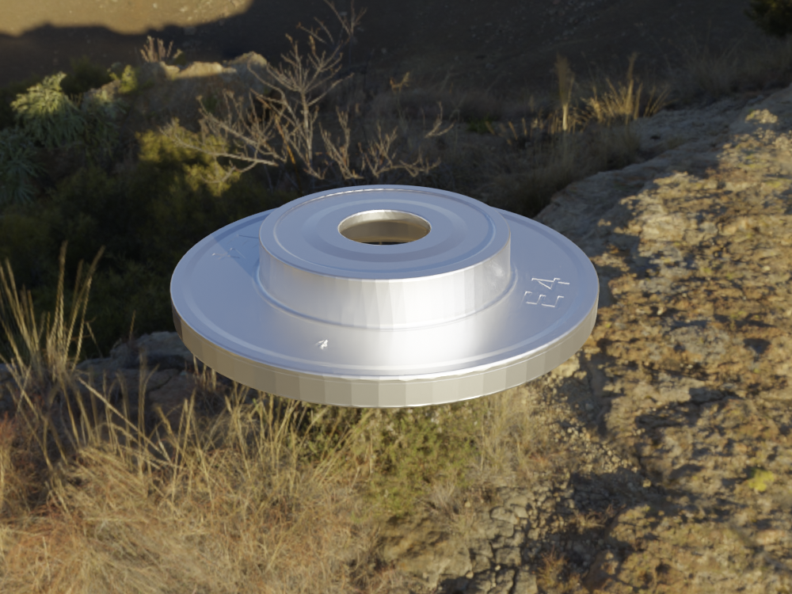

hdr_texture
======================================

.. code-block:: shell

    blender -b --python examples/hdr_texture.py

This script will randomly select 10 textures from all HDR textures and render the images:

