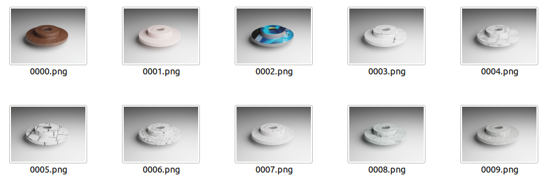
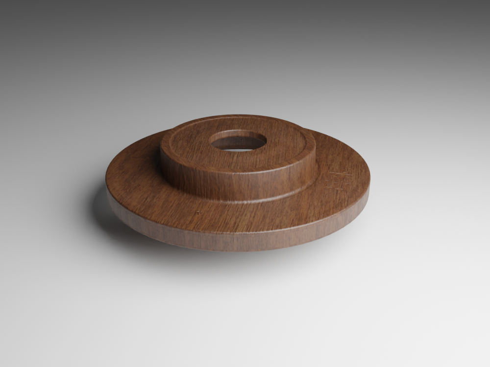

pbr_texture
======================================

.. code-block:: shell

    blender -b --python examples/pbr_texture.py

This script will randomly select 10 textures from all PBR textures and render the images:

