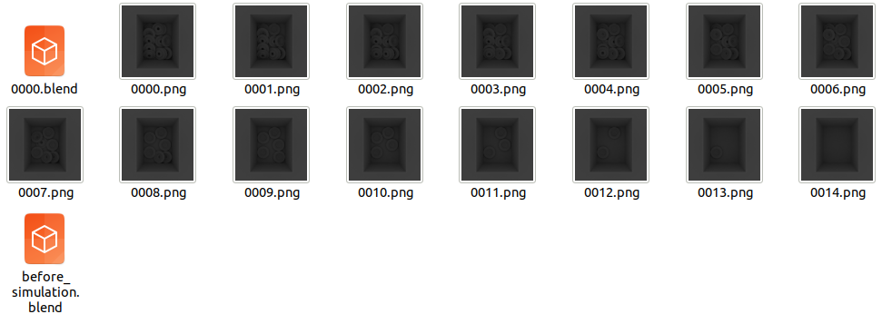
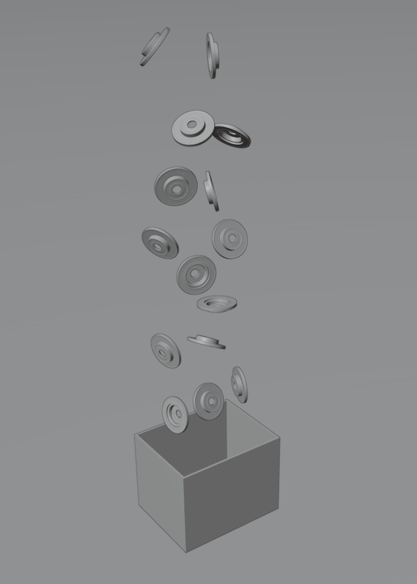
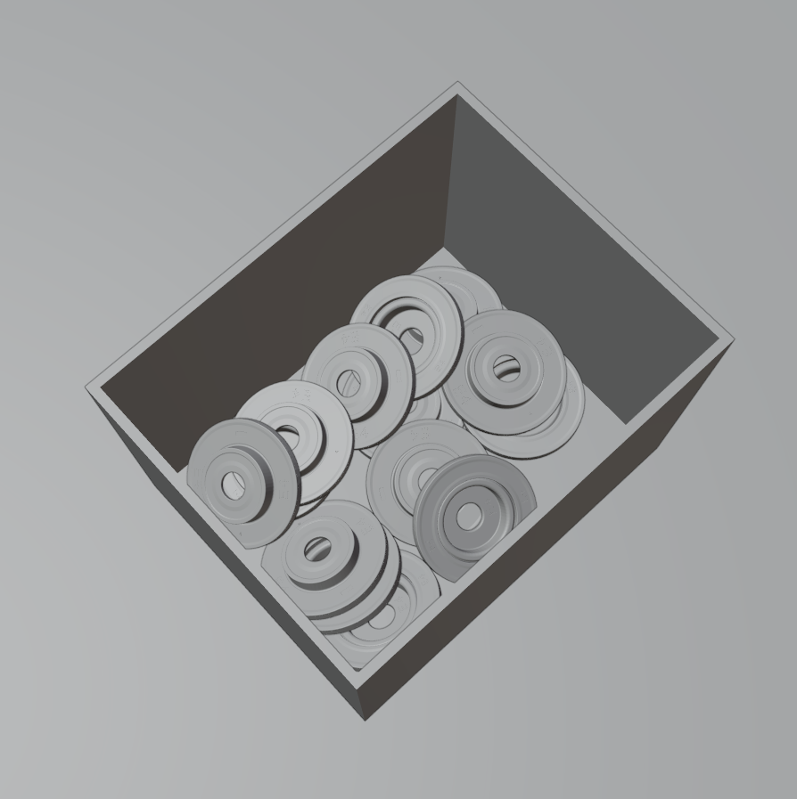

physics_simulation
======================================

.. code-block:: shell

    blender -b --python examples/physics_simulation.py

This script will generate 15 images and 2 blend files: 

Before physics simulation
---------------------------------
We use a pose sampler to generate random poses that will 
finally make the objects fall into the tote.

After physics simulation
---------------------------------
All objects fall into the tote.

