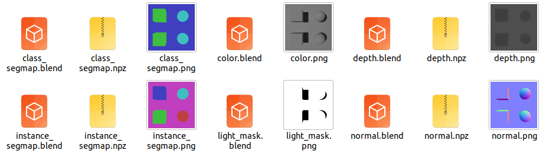
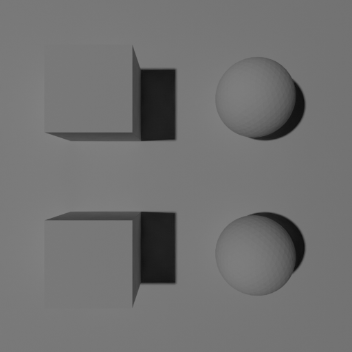
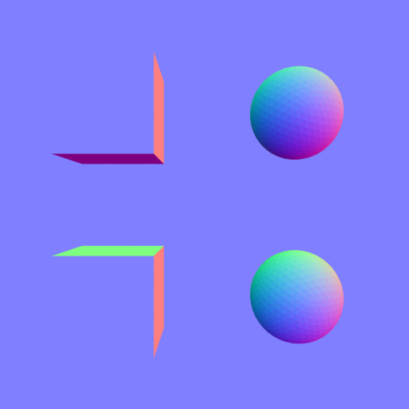
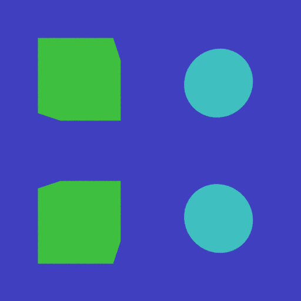
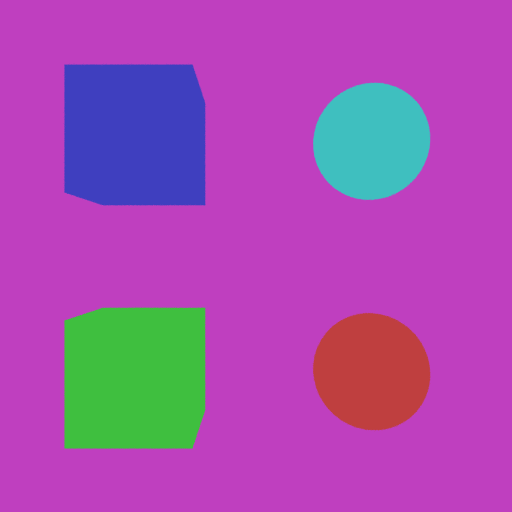
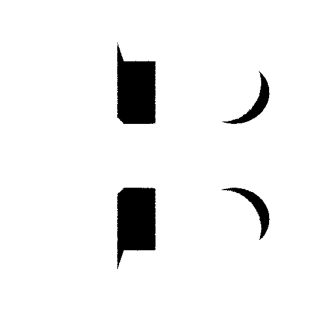

renderers
======================================

.. code-block:: shell

    blender -b --python examples/renderers.py

Color
-------------

Depth
-------------

Normal
-------------

Class SegMap
---------------

Instance SegMap
----------------

Light Mask
----------------
