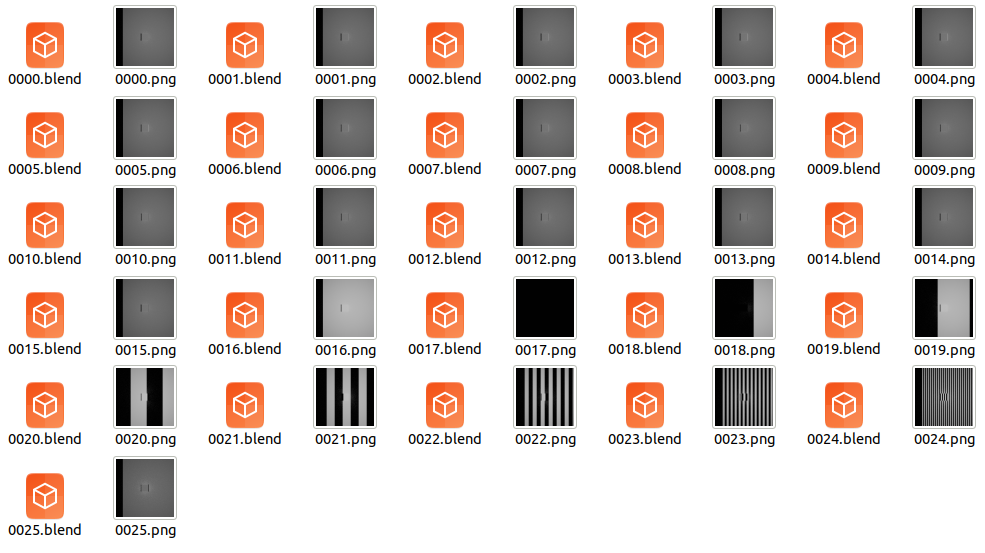
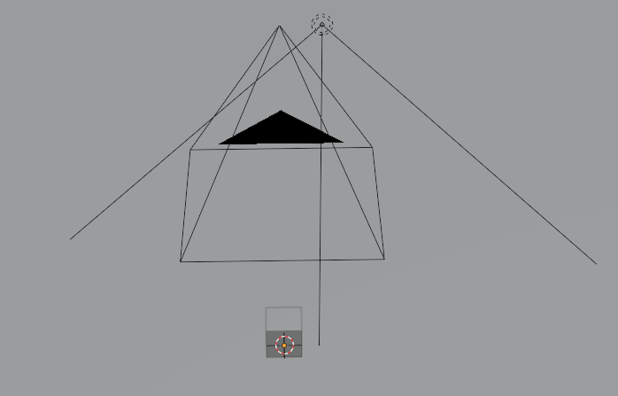

structrued_light
======================================

.. code-block:: shell

    blender -b --python examples/structured_light.py

This script will generate 26 images and corresponding blend files:  

