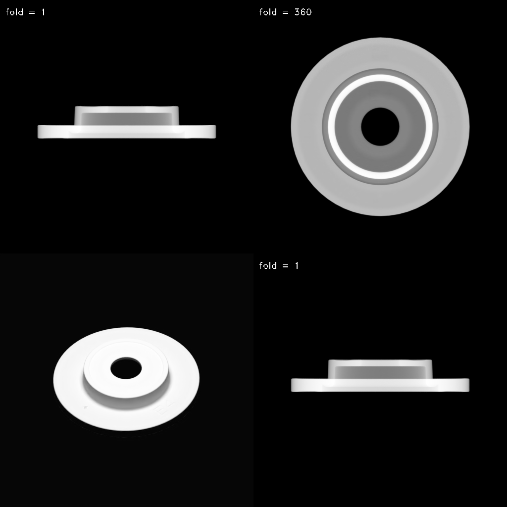
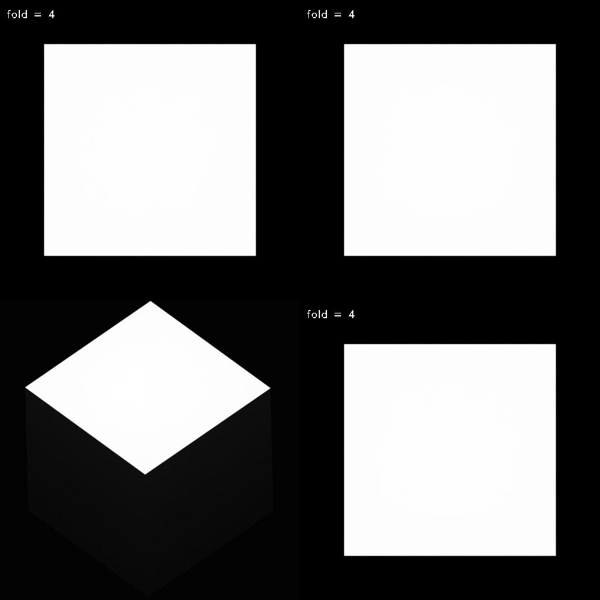

symmetry
======================================

.. code-block:: shell

    # default run
    blender -b --python examples/symmetry

    # use custom model
    blender -b --python examples/symmetry -- --model_files=resources/models/cube.ply --output_dir=output/symmetry

