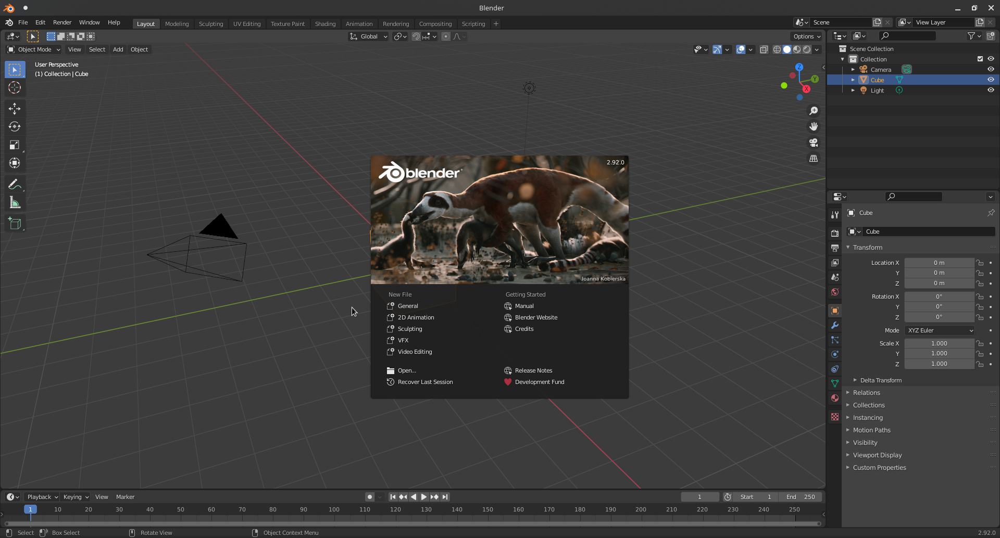
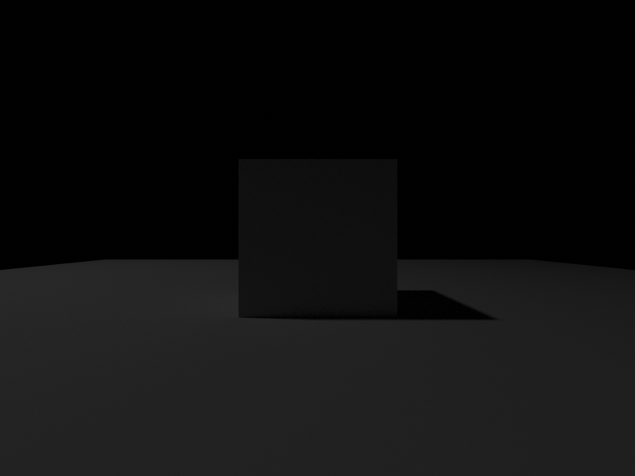

Getting Started
====================

Download Blender
---------------------
We have only tested the code on Blender-2.92, please use the same version of Blender: 

.. code-block:: shell

    cd BlenderFunc
    wget https://download.blender.org/release/Blender2.92/blender-2.92.0-linux64.tar.xz
    # or use tsinghua source
    # wget https://mirrors.tuna.tsinghua.edu.cn/blender/blender-release/Blender2.92/blender-2.92.0-linux64.tar.xz
    tar xvf blender-2.92.0-linux64.tar.xz
    
It is recommended to make a soft link to reduce typings:

.. code-block:: shell

    ln -s ./blender-2.92.0-linux64/blender .
    
If you have not used Blender before, it is recommended to try it once for the first time:

.. code-block:: shell
    
    ./blender
    
You will see the Blender GUI as below.

Run helloworld.py
---------------------------

.. code-block:: shell

    ./blender --background --python=examples/helloworld.py

``--background`` means run blender in background for UI-less rendering, 
``--python`` means run blender with given python script file. These are all 
the instructions we need to run blenderfunc.

After running, you will see the rendering results in the ``output/helloworld`` directory.

Let's understand the ``helloworld.py``: 

.. code-block:: python

    import sys
    sys.path.append('.')
    import blenderfunc as bf

    bf.initialize()
    bf.add_light(location=[-5, 0, 10], energy=100)
    bf.add_plane(10)
    cube_name = bf.add_cube(1)
    bf.get_object_by_name(cube_name).location = (0, 0, 0.5)
    bf.set_camera(pose=[[1.0,  0.0,  0.0,  0.0],
                        [0.0,  0.0,  1.0, -2.5],
                        [0.0, -1.0,  0.0,  0.5],
                        [0.0,  0.0,  0.0,  1.0]])
    bf.render_color('output/helloworld/output.png', save_blend_file=True)

First, we should note that Blender is using its own python environment. 
Therefore, all code is executed using Blender's own python binary. 
We can find the Blender's python binary path is ``blender-2.92.0-linux64/2.92/python/bin/python3.7m``.

.. code-block:: python

    import sys
    sys.path.append('.')

The above two lines add the current directory to the python searching path, allowing Blender python 
to find BlenderFunc.

.. code-block:: python

    import blenderfunc as bf

The above line will first install the dependencies of BlenderFunc using the pip tool embedded in Blender, then 
import all BlenderFunc APIs. You can check the ``blenderfunc/__init__.py`` for detail.

.. code-block:: python

    bf.initialize()
    bf.add_light(location=[-5, 0, 10], energy=100)
    bf.add_plane(10)
    cube_name = bf.add_cube(1)
    bf.get_object_by_name(cube_name).location = (0, 0, 0.5)
    bf.set_camera(pose=[[1.0,  0.0,  0.0,  0.0],
                        [0.0,  0.0,  1.0, -2.5],
                        [0.0, -1.0,  0.0,  0.5],
                        [0.0,  0.0,  0.0,  1.0]])

Initialize the Blender scene, add a light source, add a plane, add a cube and set its location, set a camera.

.. code-block:: python

    bf.render_color('output/helloworld/output.png', save_blend_file=True)

Render the scene and save the color image to ``output/helloworld/output.png``, it will also 
save the ".blend" file for debugging purpose if ``save_blend_file=True``.